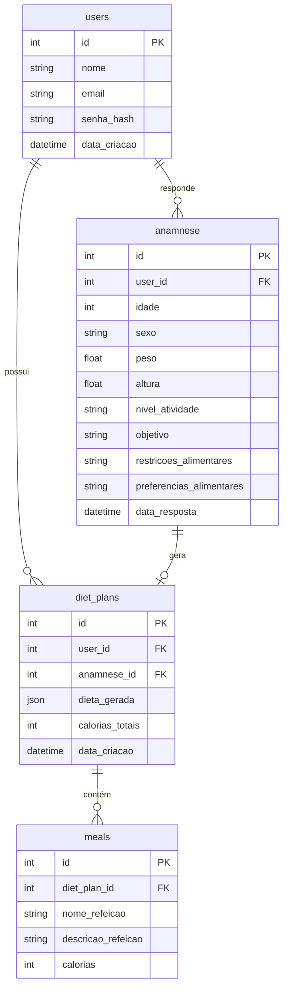

# Modelagem do Banco de Dados - MyNutri AI

## Visão Geral

O banco de dados é responsável por armazenar todas as informações da aplicação, incluindo dados dos usuários, respostas da anamnese e planos alimentares gerados.

### Diagrama de Entidade-Relacionamento (ERD)

---

## Tabela: users

Armazena informações básicas dos usuários.

Campos:

- id
- nome
- email
- senha_hash
- data_criacao

---

## Tabela: anamnese

Armazena as respostas do questionário nutricional.

Campos:

- id
- user_id
- idade
- sexo
- peso
- altura
- nivel_atividade
- objetivo
- restricoes_alimentares
- preferencias_alimentares
- data_resposta

Relacionamento:

anamnese.user_id → users.id

---

## Tabela: diet_plans

Armazena os planos alimentares gerados pela IA.

Campos:

- id
- user_id
- anamnese_id
- dieta_gerada
- calorias_totais
- data_criacao

Relacionamentos:

diet_plans.user_id → users.id  
diet_plans.anamnese_id → anamnese.id

---

## Tabela: meals

Armazena refeições individuais de um plano alimentar.

Campos:

- id
- diet_plan_id
- nome_refeicao
- descricao_refeicao
- calorias

Relacionamento:

meals.diet_plan_id → diet_plans.id